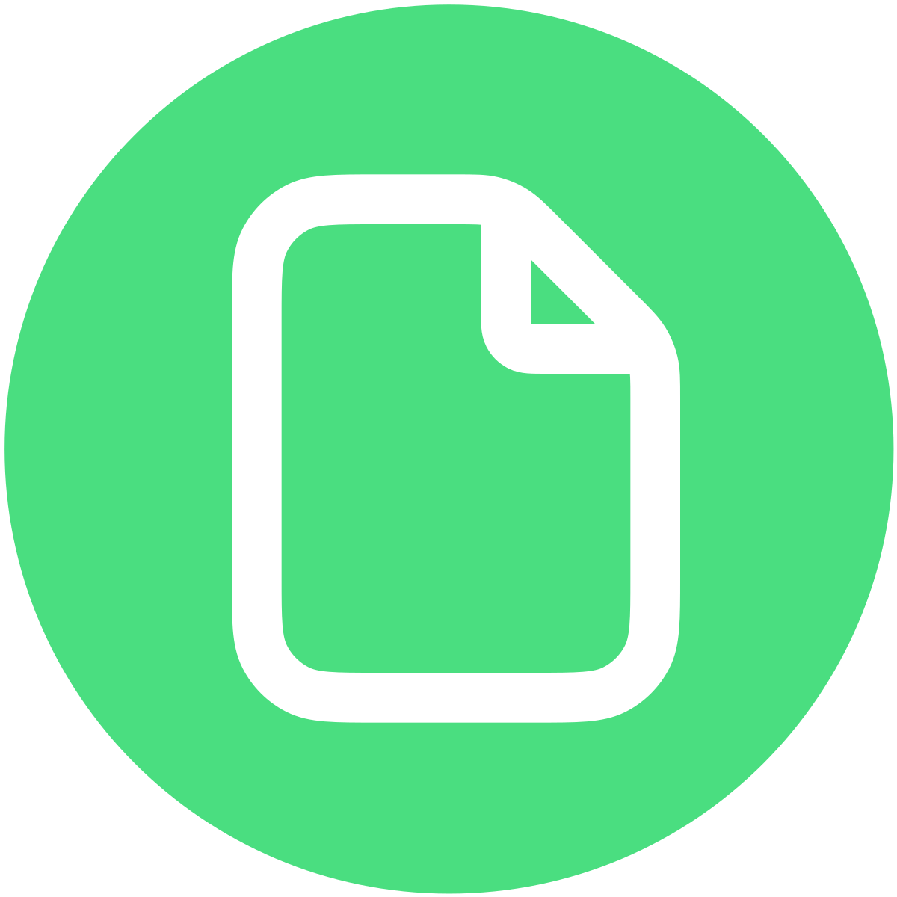

    

<h1 align="center">PdfDing</h1>

  Selfhosted PDF manager, viewer and editor offering a seamless user experience on multiple devices.

  <a href="https://www.pdfding.com">Website</a>
  &nbsp;•&nbsp;
  <a href="https://demo.pdfding.com">Demo</a>
  &nbsp;•&nbsp;
  <a href="https://docs.pdfding.com">Docs</a>
  &nbsp;•&nbsp;
  <a href="https://docs.pdfding.com/getting_started/docker/">Get Started</a>

 

## Introduction

PdfDing is a PDF manager, viewer and editor that you can host yourself. It offers a seamless user experience on multiple
devices. It's designed be to be minimal, fast, and easy to set up using Docker.

The name is a combination of PDF and *ding*. Ding is the German word for thing. Thus, PdfDing is a thing for
your PDFs.

A live demo is available at [demo.pdfding.com](https://demo.pdfding.com/).

## Features

* Seamless browser based PDF viewing on multiple devices. Remembers current position - continue where you stopped reading
* Stay on top of your PDF collection with workspaces, collections, multi-level tagging,
  starring and archiving functionalities
* Edit PDFs by adding text, highlighting and drawings
* Add signatures to PDFs and access them on all devices
* Manage and export PDF highlights and comments in dedicated sections
* Clean, intuitive UI with dark mode, inverted color mode and multiple layouts
* SSO support via OIDC
* Use bulk actions to manage multiple PDFs at once
* Share collections and PDFs with an external audience via a link or a QR Code with optional access control
* Protect accounts with two-factor authentication (TOTP + WebAuthn)
* Markdown Notes
* Progress bars show the reading progress of each PDF at a quick glance

## Getting started

### Self-Host

Ready to dive into PdfDing? Then head over to the
[Getting Started](https://docs.pdfding.com/getting_started/docker/) pages of the
documentation and find instructions for setting up PdfDing via Docker, Docker Compose
and Helm. Configuration options can be found [here](https://docs.pdfding.com/configuration/).

### PikaPods

You can deploy PdfDing [via PikaPods](https://www.pikapods.com/pods?run=pdfding) (~2.70 $/month)
and get started in less than two minutes. Ideal for non-technical users that want to use PdfDing.

PikaPods donates 20% of the fees people like you pay to run PdfDing on their servers to PdfDing.

## Contributing

Small improvements, bugfixes and documentation improvements are always welcome.
If you want to contribute a larger feature, consider opening an issue first to
discuss it. I may choose to ignore PRs for features that don't align with the
project's goals or that I don't want to maintain.

If you are interested in contributing more information can be found in the
[Contributing](https://docs.pdfding.com/contributing/about/) pages of the docs.
There are also ways to contribute if you are not a developer.

## Website & Docs

The repository, which contains the source code for the [project website](https://pdfding.com)
and the [documentation](https://docs.pdfding.com), can be found on
[Codeberg](https://codeberg.org/mrmn/PdfDing-website).

## Acknowledgements

This project was funded through the [NGI0 Commons Fund](https://nlnet.nl/commonsfund), a fund established by
[NLnet](https://nlnet.nl) with financial support from the European Commission's
[Next Generation Internet](https://ngi.eu) programme, under the aegis of DG Communications Networks,
Content and Technology under grant agreement No 101135429.

&nbsp;&nbsp;&nbsp;

